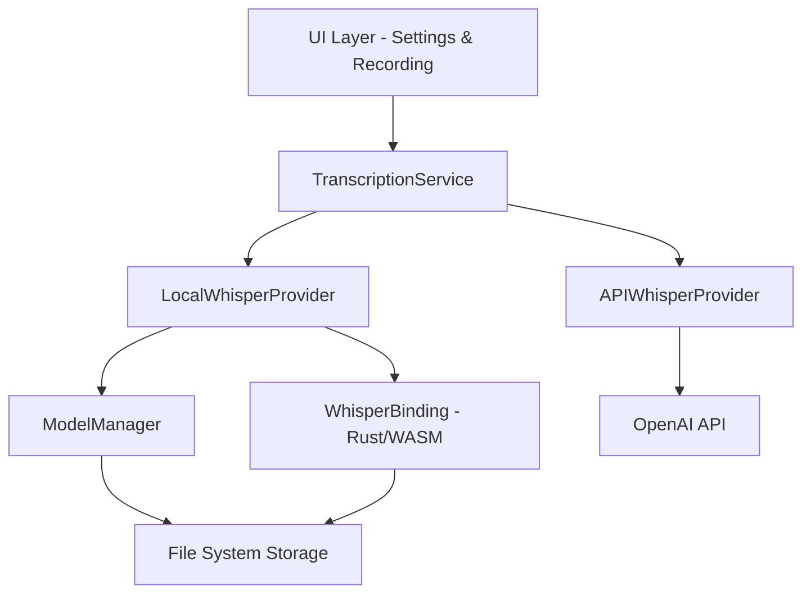

# Design Document: Local Whisper Support

## Overview

This design adds local Whisper model support to the Voice Intelligence Desktop App, enabling offline transcription using GGML-format Whisper models. The implementation extends the existing TranscriptionService architecture with a new LocalWhisperProvider that runs models directly on the user's device, complementing the existing OpenAI API provider.

The design follows a provider pattern where both API and local transcription implement a common interface, allowing seamless switching between methods. A new ModelManager component handles the lifecycle of model files (download, validation, storage), while the UI layer provides intuitive model selection and status feedback.

Key design goals:
- Maintain backward compatibility with existing API transcription
- Provide a unified interface for both transcription methods
- Optimize performance through model caching and background processing
- Implement robust error handling with automatic fallback
- Deliver clear user feedback throughout the transcription pipeline

## Architecture

### High-Level Architecture



### Component Responsibilities

**TranscriptionService (Enhanced)**
- Maintains the existing interface for transcription requests
- Routes requests to appropriate provider (API or Local) based on user settings
- Implements fallback logic when local transcription fails
- Manages provider lifecycle and caching

**LocalWhisperProvider (New)**
- Implements the transcription provider interface
- Loads and manages Whisper model instances
- Processes audio through the Whisper binding
- Handles model-specific errors and resource management

**APIWhisperProvider (Existing)**
- Continues to handle OpenAI API-based transcription
- No changes required to existing implementation

**ModelManager (New)**
- Downloads model files from trusted sources
- Validates model integrity using checksums
- Manages model storage and cleanup
- Provides model metadata (size, accuracy, performance)

**WhisperBinding (New)**
- Rust-based binding to whisper.cpp library
- Exposes TypeScript-friendly API through Tauri commands
- Handles low-level model loading and inference
- Manages memory and threading for optimal performance

### Technology Stack

**Frontend (TypeScript/Next.js)**
- React components for model selection UI
- Settings persistence using local storage
- Progress tracking and status display

**Backend (Rust/Tauri)**
- whisper.cpp integration for model inference
- File system operations for model management
- Background threading for non-blocking transcription

**Model Format**
- GGML format (quantized models for efficient CPU inference)
- Support for model variants: tiny, base, small, medium, large

## Components and Interfaces

### TranscriptionService Interface

```typescript
interface TranscriptionProvider {
  transcribe(audio: AudioBuffer): Promise<TranscriptionResult>;
  isAvailable(): Promise<boolean>;
  getStatus(): ProviderStatus;
}

interface TranscriptionResult {
  text: string;
  confidence?: number;
  duration: number;
  provider: 'api' | 'local';
}

interface ProviderStatus {
  available: boolean;
  error?: string;
  details?: Record<string, any>;
}

class TranscriptionService {
  private apiProvider: APIWhisperProvider;
  private localProvider: LocalWhisperProvider;
  private settings: TranscriptionSettings;

  async transcribe(audio: AudioBuffer): Promise<TranscriptionResult> {
    const provider = this.getActiveProvider();
    
    try {
      return await provider.transcribe(audio);
    } catch (error) {
      if (this.settings.enableFallback && provider === this.localProvider) {
        console.warn('Local transcription failed, falling back to API', error);
        return await this.apiProvider.transcribe(audio);
      }
      throw error;
    }
  }

  private getActiveProvider(): TranscriptionProvider {
    return this.settings.method === 'local' 
      ? this.localProvider 
      : this.apiProvider;
  }
}
```

### LocalWhisperProvider

```typescript
interface WhisperModel {
  variant: ModelVariant;
  path: string;
  loaded: boolean;
  lastUsed: Date;
}

type ModelVariant = 'tiny' | 'base' | 'small' | 'medium' | 'large';

class LocalWhisperProvider implements TranscriptionProvider {
  private modelManager: ModelManager;
  private currentModel: WhisperModel | null = null;
  private modelUnloadTimer: NodeJS.Timeout | null = null;

  async transcribe(audio: AudioBuffer): Promise<TranscriptionResult> {
    const model = await this.ensureModelLoaded();
    
    try {
      const startTime = Date.now();
      const text = await this.invokeWhisper(model, audio);
      const duration = Date.now() - startTime;

      this.resetUnloadTimer();

      return {
        text,
        duration,
        provider: 'local'
      };
    } catch (error) {
      await this.unloadModel();
      throw new TranscriptionError('Local transcription failed', error);
    }
  }

  private async ensureModelLoaded(): Promise<WhisperModel> {
    if (this.currentModel?.loaded) {
      return this.currentModel;
    }

    const variant = this.getSelectedVariant();
    const modelPath = await this.modelManager.getModelPath(variant);

    if (!modelPath) {
      throw new Error(`Model ${variant} not downloaded`);
    }

    await this.loadModel(modelPath, variant);
    return this.currentModel!;
  }

  private async loadModel(path: string, variant: ModelVariant): Promise<void> {
    // Invoke Tauri command to load model in Rust backend
    await invoke('load_whisper_model', { path, variant });
    
    this.currentModel = {
      variant,
      path,
      loaded: true,
      lastUsed: new Date()
    };
  }

  private async invokeWhisper(
    model: WhisperModel, 
    audio: AudioBuffer
  ): Promise<string> {
    // Convert audio to format expected by whisper.cpp
    const audioData = this.convertAudioBuffer(audio);
    
    // Invoke Tauri command for transcription
    const result = await invoke<string>('transcribe_audio', {
      audioData,
      variant: model.variant
    });

    return result;
  }

  private resetUnloadTimer(): void {
    if (this.modelUnloadTimer) {
      clearTimeout(this.modelUnloadTimer);
    }

    // Unload model after 5 minutes of inactivity
    this.modelUnloadTimer = setTimeout(() => {
      this.unloadModel();
    }, 5 * 60 * 1000);
  }

  private async unloadModel(): Promise<void> {
    if (!this.currentModel) return;

    await invoke('unload_whisper_model');
    this.currentModel = null;

    if (this.modelUnloadTimer) {
      clearTimeout(this.modelUnloadTimer);
      this.modelUnloadTimer = null;
    }
  }

  async isAvailable(): Promise<boolean> {
    const variant = this.getSelectedVariant();
    return await this.modelManager.isModelDownloaded(variant);
  }

  getStatus(): ProviderStatus {
    return {
      available: this.currentModel?.loaded ?? false,
      details: {
        model: this.currentModel?.variant,
        lastUsed: this.currentModel?.lastUsed
      }
    };
  }
}
```

### ModelManager

```typescript
interface ModelMetadata {
  variant: ModelVariant;
  size: number; // bytes
  checksum: string;
  downloadUrl: string;
  accuracy: 'good' | 'better' | 'best';
  estimatedSpeed: 'fast' | 'medium' | 'slow';
}

interface DownloadProgress {
  variant: ModelVariant;
  bytesDownloaded: number;
  totalBytes: number;
  percentage: number;
  status: 'downloading' | 'validating' | 'complete' | 'error';
}

class ModelManager {
  private readonly MODEL_METADATA: Record<ModelVariant, ModelMetadata> = {
    tiny: {
      variant: 'tiny',
      size: 75 * 1024 * 1024, // 75 MB
      checksum: 'sha256-hash-here',
      downloadUrl: 'https://huggingface.co/ggerganov/whisper.cpp/resolve/main/ggml-tiny.bin',
      accuracy: 'good',
      estimatedSpeed: 'fast'
    },
    base: {
      variant: 'base',
      size: 142 * 1024 * 1024, // 142 MB
      checksum: 'sha256-hash-here',
      downloadUrl: 'https://huggingface.co/ggerganov/whisper.cpp/resolve/main/ggml-base.bin',
      accuracy: 'better',
      estimatedSpeed: 'fast'
    },
    small: {
      variant: 'small',
      size: 466 * 1024 * 1024, // 466 MB
      checksum: 'sha256-hash-here',
      downloadUrl: 'https://huggingface.co/ggerganov/whisper.cpp/resolve/main/ggml-small.bin',
      accuracy: 'better',
      estimatedSpeed: 'medium'
    },
    medium: {
      variant: 'medium',
      size: 1.5 * 1024 * 1024 * 1024, // 1.5 GB
      checksum: 'sha256-hash-here',
      downloadUrl: 'https://huggingface.co/ggerganov/whisper.cpp/resolve/main/ggml-medium.bin',
      accuracy: 'best',
      estimatedSpeed: 'slow'
    },
    large: {
      variant: 'large',
      size: 2.9 * 1024 * 1024 * 1024, // 2.9 GB
      checksum: 'sha256-hash-here',
      downloadUrl: 'https://huggingface.co/ggerganov/whisper.cpp/resolve/main/ggml-large-v3.bin',
      accuracy: 'best',
      estimatedSpeed: 'slow'
    }
  };

  private modelsDirectory: string;
  private downloadProgressCallbacks: Map<ModelVariant, (progress: DownloadProgress) => void>;

  constructor() {
    this.modelsDirectory = this.getModelsDirectory();
    this.downloadProgressCallbacks = new Map();
  }

  async downloadModel(
    variant: ModelVariant,
    onProgress?: (progress: DownloadProgress) => void
  ): Promise<void> {
    const metadata = this.MODEL_METADATA[variant];
    const targetPath = this.getModelPath(variant);

    if (onProgress) {
      this.downloadProgressCallbacks.set(variant, onProgress);
    }

    try {
      // Use Tauri's download API for better progress tracking
      await invoke('download_model', {
        url: metadata.downloadUrl,
        targetPath,
        expectedSize: metadata.size,
        checksum: metadata.checksum
      });

      // Validate after download
      const isValid = await this.validateModel(variant);
      if (!isValid) {
        await this.deleteModel(variant);
        throw new Error(`Model validation failed for ${variant}`);
      }

      onProgress?.({
        variant,
        bytesDownloaded: metadata.size,
        totalBytes: metadata.size,
        percentage: 100,
        status: 'complete'
      });
    } catch (error) {
      onProgress?.({
        variant,
        bytesDownloaded: 0,
        totalBytes: metadata.size,
        percentage: 0,
        status: 'error'
      });
      throw error;
    } finally {
      this.downloadProgressCallbacks.delete(variant);
    }
  }

  async validateModel(variant: ModelVariant): Promise<boolean> {
    const metadata = this.MODEL_METADATA[variant];
    const modelPath = this.getModelPath(variant);

    try {
      const checksum = await invoke<string>('calculate_file_checksum', { 
        path: modelPath 
      });
      return checksum === metadata.checksum;
    } catch {
      return false;
    }
  }

  async isModelDownloaded(variant: ModelVariant): Promise<boolean> {
    const modelPath = this.getModelPath(variant);
    const exists = await invoke<boolean>('file_exists', { path: modelPath });
    
    if (!exists) return false;
    
    return await this.validateModel(variant);
  }

  async deleteModel(variant: ModelVariant): Promise<void> {
    const modelPath = this.getModelPath(variant);
    await invoke('delete_file', { path: modelPath });
  }

  getModelMetadata(variant: ModelVariant): ModelMetadata {
    return this.MODEL_METADATA[variant];
  }

  getAllModelMetadata(): ModelMetadata[] {
    return Object.values(this.MODEL_METADATA);
  }

  private getModelPath(variant: ModelVariant): string {
    return `${this.modelsDirectory}/ggml-${variant}.bin`;
  }

  private getModelsDirectory(): string {
    // Platform-specific app data directory
    // Will be provided by Tauri's path API
    return invoke<string>('get_models_directory');
  }

  async getAvailableDiskSpace(): Promise<number> {
    return await invoke<number>('get_available_disk_space', {
      path: this.modelsDirectory
    });
  }
}
```

### Settings UI Components

```typescript
interface TranscriptionSettings {
  method: 'api' | 'local';
  localModelVariant: ModelVariant;
  enableFallback: boolean;
  apiKey?: string;
}

interface ModelSelectionProps {
  settings: TranscriptionSettings;
  onSettingsChange: (settings: TranscriptionSettings) => void;
}

function ModelSelection({ settings, onSettingsChange }: ModelSelectionProps) {
  const [modelStatuses, setModelStatuses] = useState<Map<ModelVariant, boolean>>(new Map());
  const [downloading, setDownloading] = useState<ModelVariant | null>(null);
  const [downloadProgress, setDownloadProgress] = useState<DownloadProgress | null>(null);

  const modelManager = useModelManager();

  useEffect(() => {
    // Check which models are downloaded
    async function checkModels() {
      const statuses = new Map<ModelVariant, boolean>();
      for (const variant of ['tiny', 'base', 'small', 'medium', 'large'] as ModelVariant[]) {
        const downloaded = await modelManager.isModelDownloaded(variant);
        statuses.set(variant, downloaded);
      }
      setModelStatuses(statuses);
    }
    checkModels();
  }, []);

  const handleDownloadModel = async (variant: ModelVariant) => {
    setDownloading(variant);
    try {
      await modelManager.downloadModel(variant, (progress) => {
        setDownloadProgress(progress);
      });
      setModelStatuses(prev => new Map(prev).set(variant, true));
    } catch (error) {
      console.error('Download failed:', error);
      // Show error notification
    } finally {
      setDownloading(null);
      setDownloadProgress(null);
    }
  };

  return (
    <div className="model-selection">
      <h3>Transcription Method</h3>
      
      <RadioGroup value={settings.method} onChange={(method) => 
        onSettingsChange({ ...settings, method })
      }>
        <Radio value="api">OpenAI API (Cloud)</Radio>
        <Radio value="local">Local Whisper Model (Offline)</Radio>
      </RadioGroup>

      {settings.method === 'local' && (
        <div className="model-variants">
          <h4>Select Model Variant</h4>
          {modelManager.getAllModelMetadata().map(metadata => (
            <ModelVariantCard
              key={metadata.variant}
              metadata={metadata}
              isDownloaded={modelStatuses.get(metadata.variant) ?? false}
              isSelected={settings.localModelVariant === metadata.variant}
              isDownloading={downloading === metadata.variant}
              downloadProgress={downloadProgress}
              onSelect={() => onSettingsChange({ 
                ...settings, 
                localModelVariant: metadata.variant 
              })}
              onDownload={() => handleDownloadModel(metadata.variant)}
            />
          ))}
        </div>
      )}

      <Checkbox
        checked={settings.enableFallback}
        onChange={(enabled) => onSettingsChange({ 
          ...settings, 
          enableFallback: enabled 
        })}
      >
        Enable fallback to API if local transcription fails
      </Checkbox>
    </div>
  );
}
```

## Data Models

### Configuration Storage

```typescript
interface AppConfig {
  transcription: TranscriptionSettings;
  models: {
    downloadedVariants: ModelVariant[];
    storageDirectory: string;
  };
}

// Stored in: ~/.config/voice-intelligence/config.json (Linux/WSL)
// Or platform-specific equivalent via Tauri
```

### Audio Data Format

```typescript
interface AudioBuffer {
  sampleRate: number; // e.g., 16000 Hz (required by Whisper)
  channels: number; // 1 (mono, required by Whisper)
  data: Float32Array; // PCM audio samples
  duration: number; // seconds
}
```

### Rust Backend Data Structures

```rust
// src-tauri/src/whisper.rs

pub struct WhisperContext {
    ctx: *mut whisper_cpp::WhisperContext,
    variant: ModelVariant,
}

pub enum ModelVariant {
    Tiny,
    Base,
    Small,
    Medium,
    Large,
}

pub struct TranscriptionParams {
    language: Option<String>,
    translate: bool,
    num_threads: usize,
}

pub struct TranscriptionResult {
    text: String,
    segments: Vec<TranscriptionSegment>,
}

pub struct TranscriptionSegment {
    start: f64,
    end: f64,
    text: String,
}
```

## Error Handling

### Error Types

```typescript
class TranscriptionError extends Error {
  constructor(
    message: string,
    public readonly cause?: Error,
    public readonly recoverable: boolean = false
  ) {
    super(message);
    this.name = 'TranscriptionError';
  }
}

class ModelError extends Error {
  constructor(
    message: string,
    public readonly variant: ModelVariant,
    public readonly cause?: Error
  ) {
    super(message);
    this.name = 'ModelError';
  }
}

class DownloadError extends Error {
  constructor(
    message: string,
    public readonly variant: ModelVariant,
    public readonly bytesDownloaded: number,
    public readonly cause?: Error
  ) {
    super(message);
    this.name = 'DownloadError';
  }
}
```

### Error Handling Strategy

**Model Download Failures**
- Network errors: Retry with exponential backoff (3 attempts)
- Disk space errors: Notify user with space requirements
- Checksum failures: Delete partial file, offer re-download

**Model Loading Failures**
- Corrupted file: Offer to re-download
- Insufficient memory: Suggest smaller variant or API fallback
- Missing file: Prompt user to download

**Transcription Failures**
- Model inference errors: Log details, trigger fallback if enabled
- Audio format errors: Convert audio format automatically
- Timeout errors: Cancel operation, allow retry

**Fallback Logic**
```typescript
async function transcribeWithFallback(
  audio: AudioBuffer,
  settings: TranscriptionSettings
): Promise<TranscriptionResult> {
  if (settings.method === 'local') {
    try {
      return await localProvider.transcribe(audio);
    } catch (error) {
      if (settings.enableFallback) {
        notifyUser('Local transcription failed, using API fallback');
        return await apiProvider.transcribe(audio);
      }
      throw error;
    }
  }
  
  return await apiProvider.transcribe(audio);
}
```

## Testing Strategy

The testing strategy employs both unit tests and property-based tests to ensure comprehensive coverage. Unit tests validate specific examples, edge cases, and integration points, while property-based tests verify universal correctness properties across randomized inputs.

### Unit Testing Approach

**Component Tests**
- ModelManager: Test download, validation, deletion operations
- LocalWhisperProvider: Test model loading, transcription, unloading
- TranscriptionService: Test provider routing and fallback logic
- Settings UI: Test user interactions and state management

**Integration Tests**
- End-to-end transcription flow (audio input → transcribed text)
- Fallback mechanism (local failure → API success)
- Model lifecycle (download → validate → load → transcribe → unload)

**Edge Cases**
- Empty audio input
- Corrupted model files
- Network failures during download
- Insufficient disk space
- Insufficient memory for model loading
- Concurrent transcription requests

### Property-Based Testing Configuration

- Library: fast-check (TypeScript/JavaScript property-based testing)
- Minimum iterations: 100 per property test
- Each test tagged with: **Feature: local-whisper-support, Property N: [property text]**


## Correctness Properties

*A property is a characteristic or behavior that should hold true across all valid executions of a system—essentially, a formal statement about what the system should do. Properties serve as the bridge between human-readable specifications and machine-verifiable correctness guarantees.*

### Property 1: Model Download Triggers for Missing Files

*For any* model variant that is not already downloaded, when a user selects that variant, the ModelManager should initiate a download of the corresponding GGML model file.

**Validates: Requirements 1.1**

### Property 2: Download Progress Reporting

*For any* model download or transcription operation, progress callbacks should be invoked with monotonically increasing percentage values from 0 to 100.

**Validates: Requirements 1.2, 4.2**

### Property 3: Post-Download Validation

*For any* completed model download, the ModelManager should perform checksum validation before marking the model as available.

**Validates: Requirements 1.3**

### Property 4: Corrupted File Cleanup

*For any* model file that fails checksum validation, the ModelManager should delete the file and return an error indicating corruption.

**Validates: Requirements 1.4**

### Property 5: Consistent Storage Location

*For all* downloaded model files, they should be stored in the designated application data directory, not in arbitrary locations.

**Validates: Requirements 1.5**

### Property 6: Model Deletion Removes Files

*For any* model variant, when the delete operation is called, the corresponding model file should no longer exist on the file system.

**Validates: Requirements 1.7**

### Property 7: Provider Routing Based on Settings

*For any* transcription request, the TranscriptionService should route to the LocalWhisperProvider when settings.method is 'local' and to the APIWhisperProvider when settings.method is 'api'.

**Validates: Requirements 2.2**

### Property 8: Consistent Output Format

*For any* audio input, both the LocalWhisperProvider and APIWhisperProvider should return TranscriptionResult objects with the same structure (text, duration, provider fields).

**Validates: Requirements 2.4, 4.3**

### Property 9: Model Metadata Display Completeness

*For any* model variant displayed in the UI, the rendered output should include disk space requirements, accuracy rating, and performance characteristics.

**Validates: Requirements 3.3, 7.1, 7.2, 7.3**

### Property 10: Settings Persistence Round-Trip

*For any* valid TranscriptionSettings object, saving it to storage and then loading it back should produce an equivalent settings object.

**Validates: Requirements 3.4, 3.5, 8.1, 8.2**

### Property 11: Model Loading Before Transcription

*For any* local transcription request, the system should ensure the selected Whisper model is loaded into memory before attempting to process audio.

**Validates: Requirements 4.1**

### Property 12: Audio Length Support

*For any* audio buffer with duration up to 30 seconds, the LocalWhisperProvider should successfully process it without length-related errors.

**Validates: Requirements 4.4**

### Property 13: No External Network Calls During Local Transcription

*For any* local transcription operation, no HTTP requests should be made to external services during the processing.

**Validates: Requirements 4.5**

### Property 14: Model Reuse Across Transcriptions

*For any* sequence of transcription requests using the same model variant, the model should be loaded only once and reused for subsequent requests.

**Validates: Requirements 4.6**

### Property 15: Resource-Based Model Recommendations

*For any* system state where available memory is below a threshold (e.g., 4GB), the system should recommend smaller model variants or API transcription.

**Validates: Requirements 5.5, 10.5**

### Property 16: Fallback on Local Transcription Failure

*For any* local transcription error (model loading, insufficient memory, inference failure), when fallback is enabled, the system should attempt API transcription.

**Validates: Requirements 6.1, 6.2**

### Property 17: Fallback Notification

*For any* fallback event, the system should notify the user with a message containing the failure reason.

**Validates: Requirements 6.3**

### Property 18: Fallback Logging

*For any* fallback event, the system should create a log entry containing the error type and timestamp.

**Validates: Requirements 6.5**

### Property 19: Disk Space Highlighting

*For any* model variant, when available disk space is less than the model's size requirement, the UI should indicate that the model cannot be downloaded.

**Validates: Requirements 7.4**

### Property 20: Settings Reset to Defaults

*For any* settings state, calling the reset function should restore settings to the default configuration (method: 'api', enableFallback: true).

**Validates: Requirements 8.4**

### Property 21: Storage Directory Configuration

*For any* valid file system path, setting it as the models storage directory should result in subsequent downloads using that location.

**Validates: Requirements 8.5**

### Property 22: Download Error Messages Include Details

*For any* model download failure, the error message should include the specific failure reason (network error, disk space, checksum mismatch, etc.).

**Validates: Requirements 9.1**

### Property 23: Corruption Recovery Offer

*For any* model file that becomes corrupted (fails validation), the system should present an option to re-download the model.

**Validates: Requirements 9.4**

### Property 24: Transcription Status Updates

*For any* transcription operation, status callbacks should be invoked with distinct stages (loading model, processing audio, finalizing) in that order.

**Validates: Requirements 9.5**

### Property 25: Concurrent Request Queuing

*For any* set of concurrent transcription requests, the system should process them sequentially using a single model instance rather than loading multiple instances.

**Validates: Requirements 10.3**

### Property 26: Memory Warning on Low Resources

*For any* system state where available memory falls below a threshold, the system should display a warning before attempting local transcription.

**Validates: Requirements 10.4**
