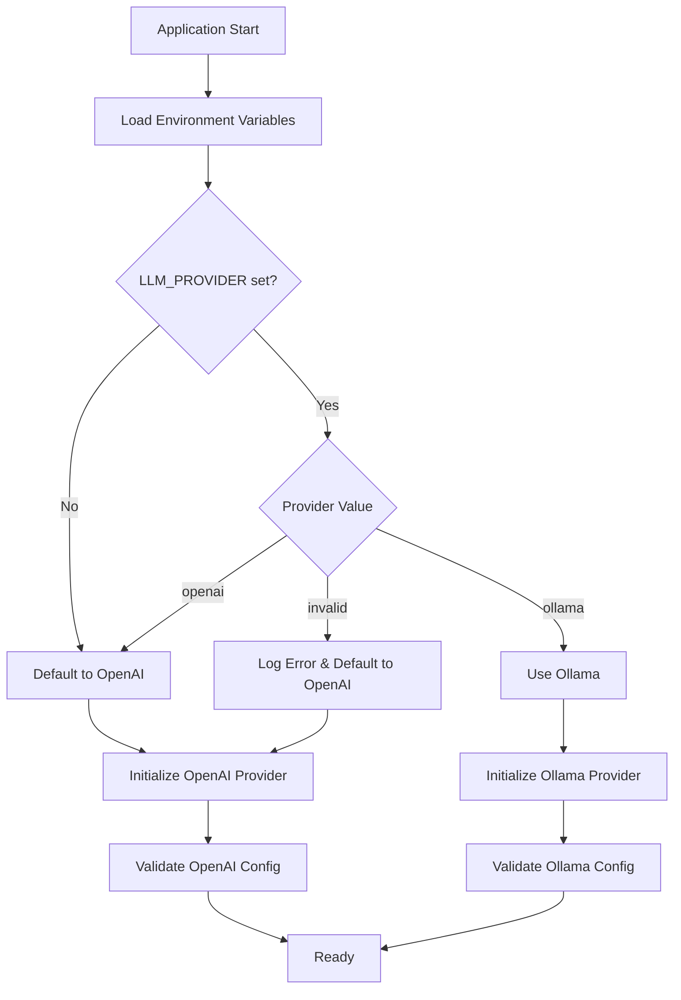

# Design Document: Remote Ollama Support

## Overview

This design adds support for remote Ollama servers as an alternative LLM provider to the existing OpenAI integration. The implementation introduces a provider abstraction pattern that allows the application to switch between OpenAI and Ollama based on configuration, while maintaining the same enrichment functionality and API surface.

The key architectural change is the introduction of a provider interface that both OpenAI and Ollama implementations will satisfy. This abstraction ensures that the LLM service layer remains provider-agnostic and makes it straightforward to add additional providers in the future.

## Architecture

### High-Level Architecture

```
┌─────────────────────────────────────────────────────────┐
│                    Next.js Application                   │
│                                                           │
│  ┌────────────────────────────────────────────────────┐ │
│  │           /api/enrich API Route                    │ │
│  └──────────────────────┬─────────────────────────────┘ │
│                         │                                │
│  ┌──────────────────────▼─────────────────────────────┐ │
│  │              LLMService                            │ │
│  │  - Provider selection logic                        │ │
│  │  - Enrichment type routing                         │ │
│  │  - Error handling & retry                          │ │
│  └──────────────────────┬─────────────────────────────┘ │
│                         │                                │
│           ┌─────────────┴─────────────┐                 │
│           │                           │                 │
│  ┌────────▼────────┐       ┌─────────▼──────────┐     │
│  │ OpenAIProvider  │       │  OllamaProvider    │     │
│  │ - GPT API calls │       │  - Ollama API calls│     │
│  │ - API key auth  │       │  - No auth         │     │
│  └────────┬────────┘       └─────────┬──────────┘     │
│           │                           │                 │
└───────────┼───────────────────────────┼─────────────────┘
            │                           │
    ┌───────▼────────┐         ┌────────▼─────────┐
    │  OpenAI API    │         │  Ollama Server   │
    │  (Remote)      │         │  (Remote/Local)  │
    └────────────────┘         └──────────────────┘
```

### Provider Selection Flow



## Components and Interfaces

### LLMProvider Interface

The core abstraction that all providers must implement:

```typescript
interface LLMProvider {
  /**
   * Enriches text based on the specified enrichment type
   * @param text - The input text to enrich
   * @param enrichmentType - The type of enrichment to apply
   * @param customPrompt - Optional custom prompt for 'custom' enrichment type
   * @returns Promise resolving to enriched text
   * @throws Error if enrichment fails
   */
  enrich(
    text: string,
    enrichmentType: EnrichmentType,
    customPrompt?: string
  ): Promise<string>;

  /**
   * Validates the provider configuration
   * @returns true if configuration is valid, false otherwise
   */
  validateConfig(): boolean;

  /**
   * Gets the provider name for logging and debugging
   * @returns The provider name (e.g., "openai", "ollama")
   */
  getProviderName(): string;

  /**
   * Performs a health check on the provider
   * @returns Promise resolving to true if provider is healthy
   */
  healthCheck(): Promise<boolean>;
}

type EnrichmentType = 
  | 'format' 
  | 'summarize' 
  | 'expand' 
  | 'bullet-points' 
  | 'action-items' 
  | 'custom';
```

### OllamaProvider Implementation

```typescript
interface OllamaConfig {
  baseUrl: string;      // Default: "http://localhost:11434"
  model: string;        // Default: "llama2"
  timeout: number;      // Default: 30000 (30 seconds)
  maxRetries: number;   // Default: 3
}

interface OllamaRequest {
  model: string;
  prompt: string;
  stream: boolean;
  options?: {
    temperature?: number;
    top_p?: number;
  };
}

interface OllamaResponse {
  model: string;
  created_at: string;
  response: string;
  done: boolean;
  context?: number[];
  total_duration?: number;
  load_duration?: number;
  prompt_eval_count?: number;
  eval_count?: number;
  eval_duration?: number;
}

class OllamaProvider implements LLMProvider {
  private config: OllamaConfig;
  
  constructor(config?: Partial<OllamaConfig>);
  
  async enrich(
    text: string,
    enrichmentType: EnrichmentType,
    customPrompt?: string
  ): Promise<string>;
  
  validateConfig(): boolean;
  getProviderName(): string;
  async healthCheck(): Promise<boolean>;
  
  private buildPrompt(
    text: string,
    enrichmentType: EnrichmentType,
    customPrompt?: string
  ): string;
  
  private async makeRequest(prompt: string): Promise<string>;
  private async retryRequest(
    prompt: string,
    attempt: number
  ): Promise<string>;
}
```

### OpenAIProvider Refactoring

The existing LLMService will be refactored into an OpenAIProvider:

```typescript
interface OpenAIConfig {
  apiKey: string;
  model: string;        // Default: "gpt-4"
  temperature: number;  // Default: 0.7
  maxTokens: number;    // Default: 1000
  maxRetries: number;   // Default: 3
}

class OpenAIProvider implements LLMProvider {
  private config: OpenAIConfig;
  
  constructor(config?: Partial<OpenAIConfig>);
  
  async enrich(
    text: string,
    enrichmentType: EnrichmentType,
    customPrompt?: string
  ): Promise<string>;
  
  validateConfig(): boolean;
  getProviderName(): string;
  async healthCheck(): Promise<boolean>;
  
  private buildPrompt(
    text: string,
    enrichmentType: EnrichmentType,
    customPrompt?: string
  ): string;
  
  private async makeRequest(prompt: string): Promise<string>;
}
```

### LLMService (Orchestrator)

The LLMService becomes a thin orchestration layer:

```typescript
class LLMService {
  private provider: LLMProvider;
  
  constructor();
  
  /**
   * Initializes the appropriate provider based on environment configuration
   */
  private initializeProvider(): LLMProvider;
  
  /**
   * Enriches text using the configured provider
   */
  async enrich(
    text: string,
    enrichmentType: EnrichmentType,
    customPrompt?: string
  ): Promise<{
    success: boolean;
    enrichedText?: string;
    error?: string;
    provider: string;
  }>;
  
  /**
   * Gets the current provider name
   */
  getProviderName(): string;
  
  /**
   * Checks if the service is properly configured
   */
  isConfigured(): boolean;
}
```

## Data Models

### Environment Variables

```typescript
interface EnvironmentConfig {
  // Provider selection
  LLM_PROVIDER?: 'openai' | 'ollama';  // Default: 'openai'
  
  // OpenAI configuration
  OPENAI_API_KEY?: string;
  GPT_MODEL?: string;                   // Default: 'gpt-4'
  GPT_TEMPERATURE?: string;             // Default: '0.7'
  GPT_MAX_TOKENS?: string;              // Default: '1000'
  
  // Ollama configuration
  OLLAMA_BASE_URL?: string;             // Default: 'http://localhost:11434'
  OLLAMA_MODEL?: string;                // Default: 'llama2'
  OLLAMA_TIMEOUT?: string;              // Default: '30000'
}
```

### Enrichment Request/Response

```typescript
interface EnrichmentRequest {
  text: string;
  enrichmentType: EnrichmentType;
  customPrompt?: string;
}

interface EnrichmentResponse {
  success: boolean;
  enrichedText?: string;
  error?: string;
  provider: string;
  metadata?: {
    model: string;
    duration?: number;
  };
}
```

### Error Types

```typescript
class LLMProviderError extends Error {
  constructor(
    message: string,
    public provider: string,
    public originalError?: Error
  );
}

class ConfigurationError extends LLMProviderError {
  constructor(message: string, provider: string);
}

class ConnectionError extends LLMProviderError {
  constructor(message: string, provider: string, originalError?: Error);
}

class APIError extends LLMProviderError {
  constructor(
    message: string,
    provider: string,
    public statusCode?: number,
    originalError?: Error
  );
}
```

## Prompt Engineering

### Enrichment Type Prompts

Both providers will use consistent prompt templates for each enrichment type:

**Format:**
```
Please format the following text to improve readability and structure. Maintain the original meaning and content:

{text}
```

**Summarize:**
```
Please provide a concise summary of the following text, capturing the key points:

{text}
```

**Expand:**
```
Please expand on the following text, adding relevant details and context while maintaining accuracy:

{text}
```

**Bullet Points:**
```
Please convert the following text into a clear, organized bullet-point list:

{text}
```

**Action Items:**
```
Please extract actionable tasks from the following text and present them as a numbered list:

{text}
```

**Custom:**
```
{customPrompt}

Text:
{text}
```

## Error Handling

### Error Handling Strategy

```typescript
// Retry logic with exponential backoff
async function retryWithBackoff<T>(
  fn: () => Promise<T>,
  maxRetries: number,
  baseDelay: number = 1000
): Promise<T> {
  let lastError: Error;
  
  for (let attempt = 0; attempt < maxRetries; attempt++) {
    try {
      return await fn();
    } catch (error) {
      lastError = error as Error;
      
      // Don't retry on configuration errors
      if (error instanceof ConfigurationError) {
        throw error;
      }
      
      // Calculate exponential backoff
      const delay = baseDelay * Math.pow(2, attempt);
      await new Promise(resolve => setTimeout(resolve, delay));
    }
  }
  
  throw new Error(
    `Failed after ${maxRetries} attempts. Last error: ${lastError.message}`
  );
}
```

### Error Response Format

```typescript
interface ErrorResponse {
  success: false;
  error: string;
  provider: string;
  errorType: 'configuration' | 'connection' | 'api' | 'unknown';
  retryable: boolean;
}
```

### Ollama-Specific Error Handling

- **Connection Refused**: "Unable to connect to Ollama server at {url}. Please ensure the server is running."
- **404 Not Found**: "Model '{model}' not found on Ollama server. Please check the model name or pull the model first."
- **Timeout**: "Request to Ollama server timed out after {timeout}ms. The model may be loading or the server may be overloaded."
- **Invalid Response**: "Received invalid response from Ollama server. Please check server logs."

## Testing Strategy

### Unit Testing

Unit tests will verify specific behaviors and edge cases:

1. **Provider Selection Tests**
   - Test default provider selection (OpenAI)
   - Test explicit provider selection via environment variable
   - Test invalid provider name handling

2. **Configuration Validation Tests**
   - Test OpenAI configuration validation (missing API key)
   - Test Ollama configuration validation (invalid URL format)
   - Test default value application

3. **Prompt Building Tests**
   - Test prompt generation for each enrichment type
   - Test custom prompt handling
   - Test prompt consistency between providers

4. **Error Handling Tests**
   - Test connection error handling
   - Test API error handling
   - Test retry logic with mocked failures
   - Test error message formatting

5. **API Integration Tests**
   - Test /api/enrich endpoint with both providers
   - Test request/response format
   - Test error responses

### Property-Based Testing

Property-based tests will verify universal properties across all inputs and configurations. These tests will run with a minimum of 100 iterations to ensure comprehensive coverage through randomization.


## Correctness Properties

*A property is a characteristic or behavior that should hold true across all valid executions of a system—essentially, a formal statement about what the system should do. Properties serve as the bridge between human-readable specifications and machine-verifiable correctness guarantees.*

### Property 1: Provider Selection Consistency

*For any* valid provider name ("openai" or "ollama"), when the LLM_PROVIDER environment variable is set to that provider name, the LLM_Service should instantiate and use the corresponding provider implementation.

**Validates: Requirements 1.1, 1.2, 1.3**

### Property 2: Invalid Provider Rejection

*For any* string that is not "openai" or "ollama", when used as the LLM_PROVIDER value, the system should log an error and default to the OpenAI provider.

**Validates: Requirements 1.5**

### Property 3: Configuration Loading

*For any* valid configuration values (URLs, model names), when set as environment variables for the selected provider, the provider should correctly load and use those values in its operations.

**Validates: Requirements 2.1, 2.2**

### Property 4: URL Validation

*For any* string provided as OLLAMA_BASE_URL, the system should accept it if and only if it is a valid HTTP or HTTPS URL format.

**Validates: Requirements 2.5, 7.3**

### Property 5: Request Structure Completeness

*For any* enrichment request to the Ollama provider, the HTTP request should include the correct endpoint (/api/generate), a JSON payload with model/prompt/stream fields, and Content-Type header set to "application/json".

**Validates: Requirements 3.1, 3.2, 3.5**

### Property 6: Response Parsing

*For any* valid Ollama API response, the provider should successfully extract the generated text from the "response" field in the JSON payload.

**Validates: Requirements 3.3**

### Property 7: Error Response Handling

*For any* error response from the Ollama server, the provider should parse the error and return a descriptive error message that includes the error type and details.

**Validates: Requirements 3.4**

### Property 8: Custom Prompt Support

*For any* user-provided custom prompt string, when using the "custom" enrichment type, the Ollama provider should include that exact prompt in the request to the server.

**Validates: Requirements 4.6**

### Property 9: Prompt Construction

*For any* enrichment type (format, summarize, expand, bullet-points, action-items), the provider should construct a prompt that includes both the enrichment instruction and the input text.

**Validates: Requirements 4.7**

### Property 10: Retry with Exponential Backoff

*For any* timeout error from the Ollama server, the provider should retry the request up to 3 times with exponentially increasing delays between attempts.

**Validates: Requirements 5.3**

### Property 11: Error Logging

*For any* enrichment request that fails, the system should log an error message that includes the provider name, model name, and error details.

**Validates: Requirements 5.5**

### Property 12: Configuration Validation and Logging

*For any* invalid or missing required configuration for the selected provider, the system should log a warning message with details about the configuration issue.

**Validates: Requirements 7.1, 7.4**

### Property 13: API Endpoint Compatibility

*For any* enrichment request (regardless of provider), the /api/enrich endpoint should accept the request and return a response in the same format, ensuring API compatibility.

**Validates: Requirements 8.3**

### Testing Strategy Summary

**Unit Tests** will cover:
- Specific provider selection examples (OpenAI, Ollama, default)
- Default value application (localhost:11434, llama2)
- Specific enrichment type examples (format, summarize, expand, bullet-points, action-items)
- Specific error cases (connection refused, 404, timeout exhaustion)
- Interface implementation verification
- Health check behavior
- Backward compatibility scenarios

**Property-Based Tests** will cover:
- Provider selection with random valid/invalid names (Property 1, 2)
- Configuration loading with random values (Property 3)
- URL validation with random strings (Property 4)
- Request structure with random prompts (Property 5)
- Response parsing with random valid responses (Property 6)
- Error handling with random error responses (Property 7)
- Custom prompts with random strings (Property 8)
- Prompt construction for all enrichment types (Property 9)
- Retry logic with simulated timeouts (Property 10)
- Error logging with random failures (Property 11)
- Configuration validation with random invalid configs (Property 12)
- API compatibility with random requests (Property 13)

Each property-based test will run a minimum of 100 iterations and will be tagged with:
**Feature: remote-ollama-support, Property {number}: {property_text}**
