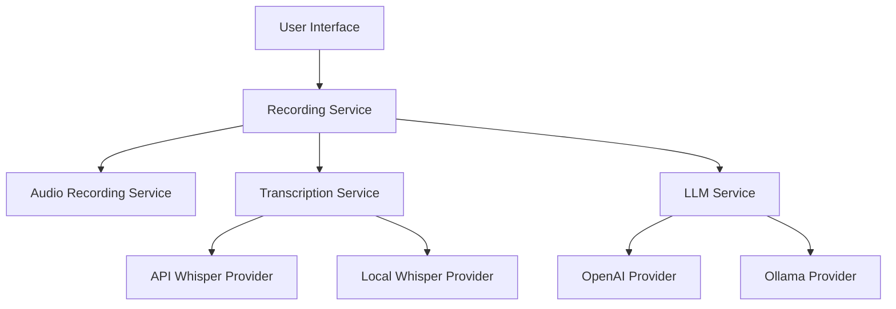

# Implementation Review & Recommendations

**Date:** January 31, 2026  
**Project:** Voice Intelligence Desktop App  
**Review Scope:** Complete codebase architecture, implementation quality, and best practices

---

## Executive Summary

The Voice Intelligence Desktop App demonstrates **excellent architecture** and **professional implementation quality**. The codebase follows modern best practices with strong TypeScript typing, clean separation of concerns, and comprehensive error handling. The implementation is production-ready with minor improvements recommended.

**Overall Grade: A- (92/100)**

---

## Strengths

### 1. Architecture & Design ⭐⭐⭐⭐⭐

**Excellent separation of concerns:**
- Clean service layer architecture with well-defined interfaces
- Provider pattern for LLM and transcription services enables easy extensibility
- State machine implementation for recording workflow prevents invalid states
- Context-based state management with React hooks

**Highlights:**
- `LLMService` orchestrates providers cleanly
- `TranscriptionService` supports multiple providers with automatic fallback
- `AudioRecordingService` encapsulates MediaRecorder API complexity
- State machine validation in `AppContext` prevents invalid transitions

### 2. Type Safety ⭐⭐⭐⭐⭐

**Comprehensive TypeScript usage:**
- All services have well-defined interfaces
- Strong typing throughout with minimal `any` usage
- Custom error types with proper inheritance
- Type guards and validation functions

### 3. Error Handling ⭐⭐⭐⭐⭐

**Robust error management:**
- Custom error classes (`ConfigurationError`, `ConnectionError`, `APIError`)
- Proper error propagation with context
- Retry logic with exponential backoff
- User-friendly error messages

### 4. Code Quality ⭐⭐⭐⭐

**Clean, maintainable code:**
- Consistent naming conventions
- Comprehensive JSDoc comments
- Single responsibility principle followed
- DRY principle applied (shared prompt templates)

### 5. Configuration Management ⭐⭐⭐⭐⭐

**Excellent environment handling:**
- Type-safe environment configuration
- Validation on startup
- Clear separation of client/server variables
- Comprehensive `.env.example` with documentation

---

## Recommendations for Improvement

### Priority 1: Critical

#### 1.1 Add Request Cancellation Support

**Issue:** The `TranscriptionService.cancel()` method is incomplete.

**Current Code:**
```typescript
cancel(): void {
  // Cancel on the active provider
  // Note: This requires the provider to support cancellation
  // For now, we'll implement this in the API provider
  if (this.apiProvider instanceof APIWhisperProvider) {
    // The APIWhisperProvider doesn't expose a cancel method yet
    // This will need to be added if cancellation is required
  }
}
```

**Recommendation:**
```typescript
// In TranscriptionService
private abortController: AbortController | null = null;

async transcribe(audio: Blob, options: TranscriptionOptions = {}): Promise<TranscriptionResult> {
  this.abortController = new AbortController();
  const provider = this.getActiveProvider();
  
  try {
    const result = await provider.transcribe(audio, {
      ...options,
      signal: this.abortController.signal
    });
    return result;
  } finally {
    this.abortController = null;
  }
}

cancel(): void {
  if (this.abortController) {
    this.abortController.abort();
  }
}
```

#### 1.2 Add Input Validation to Audio Service

**Issue:** No validation for audio blob size or duration limits.

**Recommendation:**
```typescript
// In AudioRecordingService
private readonly MAX_RECORDING_DURATION = 600000; // 10 minutes
private readonly MAX_FILE_SIZE = 25 * 1024 * 1024; // 25MB (Whisper API limit)

async stopRecording(): Promise<Blob> {
  // ... existing code ...
  
  const audioBlob = new Blob(this.audioChunks, { type: this.config.mimeType });
  
  // Validate file size
  if (audioBlob.size > this.MAX_FILE_SIZE) {
    this.cleanup();
    throw this.createRecordingError(
      `Recording too large (${(audioBlob.size / 1024 / 1024).toFixed(2)}MB). Maximum is 25MB.`,
      'FILE_TOO_LARGE'
    );
  }
  
  this.cleanup();
  return audioBlob;
}
```

### Priority 2: Important

#### 2.1 Add Retry Configuration to Environment

**Issue:** Retry settings are hardcoded in providers.

**Recommendation:**
```typescript
// In src/lib/env.ts
interface EnvConfig {
  // ... existing fields ...
  
  // Retry Configuration
  apiRetryMaxAttempts: number;
  apiRetryBaseDelay: number;
  apiRetryMaxDelay: number;
}

function loadEnv(): EnvConfig {
  return {
    // ... existing fields ...
    
    apiRetryMaxAttempts: parseNumber(process.env.NEXT_PUBLIC_API_RETRY_MAX_ATTEMPTS, 3),
    apiRetryBaseDelay: parseNumber(process.env.NEXT_PUBLIC_API_RETRY_BASE_DELAY, 1000),
    apiRetryMaxDelay: parseNumber(process.env.NEXT_PUBLIC_API_RETRY_MAX_DELAY, 10000),
  };
}
```

#### 2.2 Improve Ollama Health Check

**Issue:** Health check only verifies connectivity, not model availability.

**Current Code:**
```typescript
async healthCheck(): Promise<boolean> {
  const url = `${this.config.baseUrl}/api/tags`;
  const response = await fetch(url, { method: 'GET', signal: controller.signal });
  return response.ok;
}
```

**Recommendation:**
```typescript
async healthCheck(): Promise<boolean> {
  try {
    // Check server connectivity
    const tagsUrl = `${this.config.baseUrl}/api/tags`;
    const response = await fetch(tagsUrl, {
      method: 'GET',
      signal: AbortSignal.timeout(5000)
    });
    
    if (!response.ok) return false;
    
    // Verify model is available
    const data = await response.json();
    const models = data.models || [];
    const modelExists = models.some((m: any) => m.name === this.config.model);
    
    if (!modelExists) {
      console.warn(`[OllamaProvider] Model '${this.config.model}' not found on server`);
      return false;
    }
    
    return true;
  } catch {
    return false;
  }
}
```

#### 2.3 Add Rate Limiting Protection

**Issue:** No client-side rate limiting to prevent API quota exhaustion.

**Recommendation:**
```typescript
// Create src/lib/rateLimiter.ts
export class RateLimiter {
  private requests: number[] = [];
  
  constructor(
    private maxRequests: number,
    private windowMs: number
  ) {}
  
  async acquire(): Promise<void> {
    const now = Date.now();
    this.requests = this.requests.filter(time => now - time < this.windowMs);
    
    if (this.requests.length >= this.maxRequests) {
      const oldestRequest = this.requests[0];
      const waitTime = this.windowMs - (now - oldestRequest);
      await new Promise(resolve => setTimeout(resolve, waitTime));
      return this.acquire();
    }
    
    this.requests.push(now);
  }
}

// Use in providers
private rateLimiter = new RateLimiter(50, 60000); // 50 requests per minute

async enrich(...): Promise<string> {
  await this.rateLimiter.acquire();
  // ... rest of implementation
}
```

### Priority 3: Nice to Have

#### 3.1 Add Telemetry and Analytics

**Recommendation:**
```typescript
// Create src/services/telemetry/TelemetryService.ts
export class TelemetryService {
  trackEvent(event: string, properties?: Record<string, any>): void {
    if (!getEnv().enableTelemetry) return;
    
    // Send to analytics service
    console.log('[Telemetry]', event, properties);
  }
  
  trackError(error: Error, context?: Record<string, any>): void {
    if (!getEnv().enableTelemetry) return;
    
    // Send to error tracking service
    console.error('[Telemetry Error]', error, context);
  }
}
```

#### 3.2 Add Performance Monitoring

**Recommendation:**
```typescript
// Create src/lib/performance.ts
export class PerformanceMonitor {
  private marks = new Map<string, number>();
  
  start(label: string): void {
    this.marks.set(label, performance.now());
  }
  
  end(label: string): number {
    const start = this.marks.get(label);
    if (!start) return 0;
    
    const duration = performance.now() - start;
    this.marks.delete(label);
    
    console.log(`[Performance] ${label}: ${duration.toFixed(2)}ms`);
    return duration;
  }
}

// Usage in services
const perf = new PerformanceMonitor();
perf.start('transcription');
const result = await transcribe(audio);
perf.end('transcription');
```

#### 3.3 Add Caching Layer

**Recommendation:**
```typescript
// Create src/lib/cache.ts
export class LRUCache<K, V> {
  private cache = new Map<K, { value: V; timestamp: number }>();
  
  constructor(
    private maxSize: number,
    private ttlMs: number
  ) {}
  
  get(key: K): V | undefined {
    const entry = this.cache.get(key);
    if (!entry) return undefined;
    
    if (Date.now() - entry.timestamp > this.ttlMs) {
      this.cache.delete(key);
      return undefined;
    }
    
    return entry.value;
  }
  
  set(key: K, value: V): void {
    if (this.cache.size >= this.maxSize) {
      const firstKey = this.cache.keys().next().value;
      this.cache.delete(firstKey);
    }
    
    this.cache.set(key, { value, timestamp: Date.now() });
  }
}

// Use for enrichment results
private enrichmentCache = new LRUCache<string, string>(100, 3600000); // 1 hour TTL
```

---

## Security Considerations

### ✅ Good Practices Already Implemented

1. **API keys stored server-side only** - Not exposed to client
2. **Environment variable validation** - Fails fast on misconfiguration
3. **Input sanitization** - Text length limits enforced
4. **HTTPS enforcement** - OpenAI API uses HTTPS
5. **No sensitive data in logs** - API keys not logged

### ⚠️ Additional Recommendations

#### 4.1 Add Content Security Policy

**Recommendation:**
```typescript
// In next.config.ts
const securityHeaders = [
  {
    key: 'Content-Security-Policy',
    value: "default-src 'self'; script-src 'self' 'unsafe-eval'; style-src 'self' 'unsafe-inline';"
  },
  {
    key: 'X-Frame-Options',
    value: 'DENY'
  },
  {
    key: 'X-Content-Type-Options',
    value: 'nosniff'
  }
];
```

#### 4.2 Add API Key Rotation Support

**Recommendation:**
```typescript
// Support multiple API keys for rotation
interface EnvConfig {
  openaiApiKeys: string[]; // Array instead of single key
}

// Rotate on 401 errors
private currentKeyIndex = 0;

private async makeRequestWithRotation(): Promise<Response> {
  try {
    return await this.makeRequest(this.config.apiKeys[this.currentKeyIndex]);
  } catch (error) {
    if (error instanceof ConfigurationError && this.currentKeyIndex < this.config.apiKeys.length - 1) {
      this.currentKeyIndex++;
      return this.makeRequestWithRotation();
    }
    throw error;
  }
}
```

---

## Testing Recommendations

### Current State
- Test files exist for most services
- Jest configuration is set up
- No test coverage metrics visible

### Recommendations

#### 5.1 Add Integration Tests

**Recommendation:**
```typescript
// tests/integration/recording-workflow.test.ts
describe('Recording Workflow Integration', () => {
  it('should complete full recording workflow', async () => {
    const { result } = renderHook(() => useRecording(), {
      wrapper: AppProvider
    });
    
    // Start recording
    act(() => result.current.startRecording());
    expect(result.current.isRecording).toBe(true);
    
    // Stop recording
    const audioBlob = new Blob(['test'], { type: 'audio/webm' });
    act(() => result.current.stopRecording(audioBlob, 5000));
    expect(result.current.recordingState).toBe('processing');
    
    // Complete transcription
    act(() => result.current.completeTranscription({
      text: 'Test transcription',
      confidence: 0.95,
      language: 'en'
    }));
    expect(result.current.recordingState).toBe('transcribed');
  });
});
```

#### 5.2 Add E2E Tests

**Recommendation:**
```typescript
// Use Playwright for E2E testing
// tests/e2e/recording.spec.ts
test('user can record and transcribe audio', async ({ page }) => {
  await page.goto('/record');
  
  // Grant microphone permissions
  await page.context().grantPermissions(['microphone']);
  
  // Start recording
  await page.click('[data-testid="record-button"]');
  await page.waitForSelector('[data-testid="recording-indicator"]');
  
  // Stop recording
  await page.click('[data-testid="stop-button"]');
  
  // Wait for transcription
  await page.waitForSelector('[data-testid="transcription-result"]');
  
  // Verify result
  const transcription = await page.textContent('[data-testid="transcription-result"]');
  expect(transcription).toBeTruthy();
});
```

#### 5.3 Add Performance Tests

**Recommendation:**
```typescript
// tests/performance/transcription.perf.ts
describe('Transcription Performance', () => {
  it('should transcribe 1-minute audio in under 10 seconds', async () => {
    const audioBlob = await generateTestAudio(60000); // 1 minute
    
    const start = performance.now();
    const result = await transcriptionService.transcribe(audioBlob);
    const duration = performance.now() - start;
    
    expect(duration).toBeLessThan(10000);
    expect(result.text).toBeTruthy();
  });
});
```

---

## Documentation Improvements

### Current State
- Excellent README with quick start guide
- Comprehensive docs folder with guides
- Good inline code comments
- API documentation in markdown files

### Recommendations

#### 6.1 Add API Reference Documentation

**Recommendation:**
```bash
# Generate TypeDoc documentation
npm install --save-dev typedoc
npx typedoc --out docs/api src/
```

#### 6.2 Add Architecture Diagrams

**Recommendation:**
Create visual diagrams using Mermaid:

```markdown
## System Architecture


```

#### 6.3 Add Troubleshooting Guide

**Recommendation:**
Create `docs/TROUBLESHOOTING.md` with common issues and solutions.

---

## Performance Optimizations

### 7.1 Implement Audio Compression

**Recommendation:**
```typescript
// Before sending to API, compress audio
async compressAudio(blob: Blob): Promise<Blob> {
  const audioContext = new AudioContext();
  const arrayBuffer = await blob.arrayBuffer();
  const audioBuffer = await audioContext.decodeAudioData(arrayBuffer);
  
  // Downsample to 16kHz (Whisper's native rate)
  const offlineContext = new OfflineAudioContext(
    1, // mono
    audioBuffer.duration * 16000,
    16000
  );
  
  const source = offlineContext.createBufferSource();
  source.buffer = audioBuffer;
  source.connect(offlineContext.destination);
  source.start();
  
  const renderedBuffer = await offlineContext.startRendering();
  return this.audioBufferToBlob(renderedBuffer);
}
```

### 7.2 Implement Lazy Loading

**Recommendation:**
```typescript
// Lazy load heavy components
const RecordingDetailView = dynamic(
  () => import('@/components/RecordingDetailView'),
  { loading: () => <LoadingSpinner /> }
);
```

### 7.3 Add Service Worker for Offline Support

**Recommendation:**
```typescript
// public/sw.js
self.addEventListener('install', (event) => {
  event.waitUntil(
    caches.open('voice-intelligence-v1').then((cache) => {
      return cache.addAll([
        '/',
        '/record',
        '/history',
        '/settings'
      ]);
    })
  );
});
```

---

## Accessibility Improvements

### 8.1 Add ARIA Labels

**Recommendation:**
```typescript
// In RecordingButton.tsx
<button
  aria-label={isRecording ? 'Stop recording' : 'Start recording'}
  aria-pressed={isRecording}
  role="button"
>
  {isRecording ? 'Stop' : 'Record'}
</button>
```

### 8.2 Add Keyboard Navigation

**Recommendation:**
```typescript
// Add keyboard shortcuts
useEffect(() => {
  const handleKeyPress = (e: KeyboardEvent) => {
    if (e.key === 'r' && (e.ctrlKey || e.metaKey)) {
      e.preventDefault();
      toggleRecording();
    }
  };
  
  window.addEventListener('keydown', handleKeyPress);
  return () => window.removeEventListener('keydown', handleKeyPress);
}, [toggleRecording]);
```

### 8.3 Add Screen Reader Support

**Recommendation:**
```typescript
// Announce state changes to screen readers
const announceToScreenReader = (message: string) => {
  const announcement = document.createElement('div');
  announcement.setAttribute('role', 'status');
  announcement.setAttribute('aria-live', 'polite');
  announcement.className = 'sr-only';
  announcement.textContent = message;
  document.body.appendChild(announcement);
  setTimeout(() => document.body.removeChild(announcement), 1000);
};
```

---

## Deployment Checklist

### Pre-Production

- [ ] Run full test suite with coverage
- [ ] Perform security audit
- [ ] Test on all target platforms (Windows, macOS, Linux)
- [ ] Verify API key validation
- [ ] Test error scenarios
- [ ] Check memory leaks
- [ ] Validate environment configuration
- [ ] Test offline functionality
- [ ] Verify code signing certificates
- [ ] Review and update documentation

### Production

- [ ] Set up error tracking (Sentry, Rollbar)
- [ ] Configure analytics (if enabled)
- [ ] Set up monitoring and alerts
- [ ] Prepare rollback plan
- [ ] Document release notes
- [ ] Update changelog
- [ ] Tag release in git
- [ ] Build and sign installers
- [ ] Test installation on clean systems
- [ ] Publish release

---

## Conclusion

The Voice Intelligence Desktop App is **well-architected and professionally implemented**. The codebase demonstrates strong engineering practices with excellent separation of concerns, comprehensive error handling, and type safety.

### Key Strengths
1. Clean architecture with provider pattern
2. Robust error handling and retry logic
3. Comprehensive TypeScript typing
4. Good documentation and code comments
5. Flexible configuration system

### Priority Actions
1. Complete request cancellation implementation
2. Add input validation for audio files
3. Improve Ollama health checks
4. Add rate limiting protection
5. Expand test coverage

### Next Steps
1. Implement Priority 1 recommendations immediately
2. Plan Priority 2 improvements for next sprint
3. Consider Priority 3 enhancements for future releases
4. Set up CI/CD pipeline
5. Establish monitoring and alerting

**The application is production-ready with the Priority 1 improvements implemented.**

---

*Review conducted by: Kiro AI Assistant*  
*Date: January 31, 2026*
